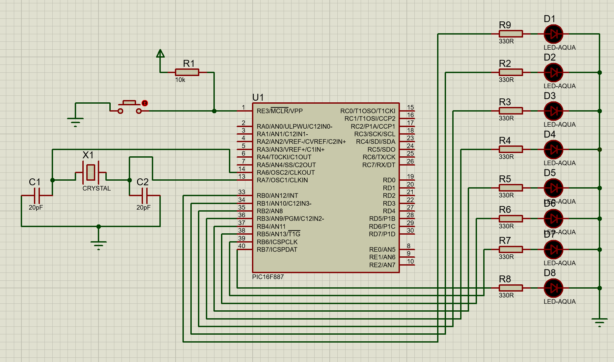
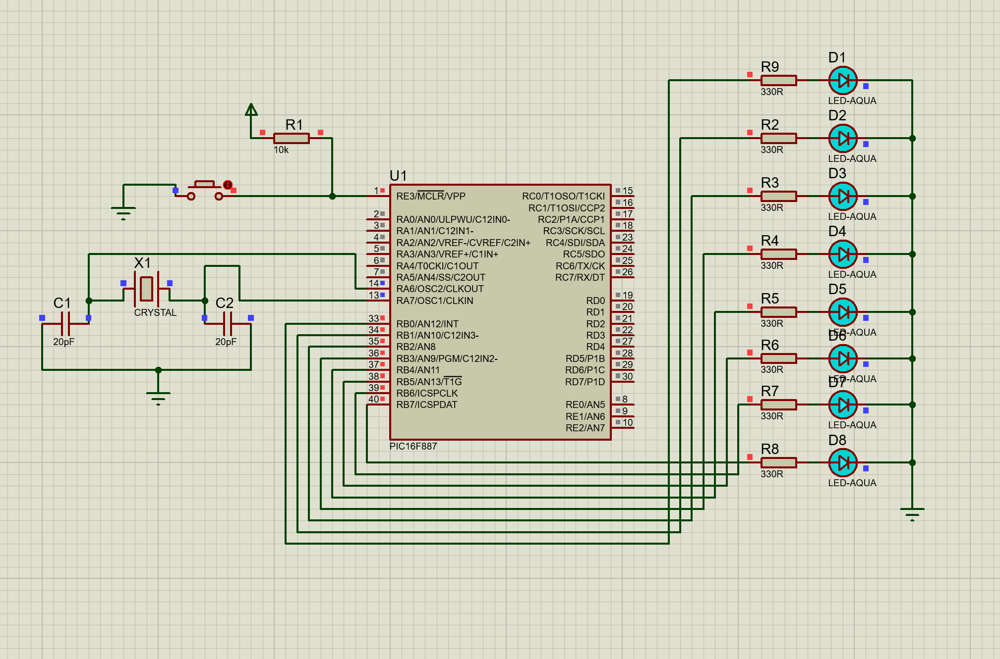
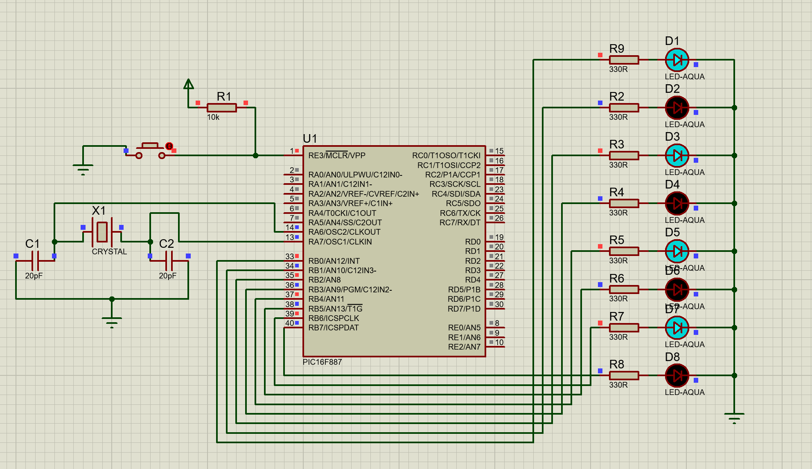
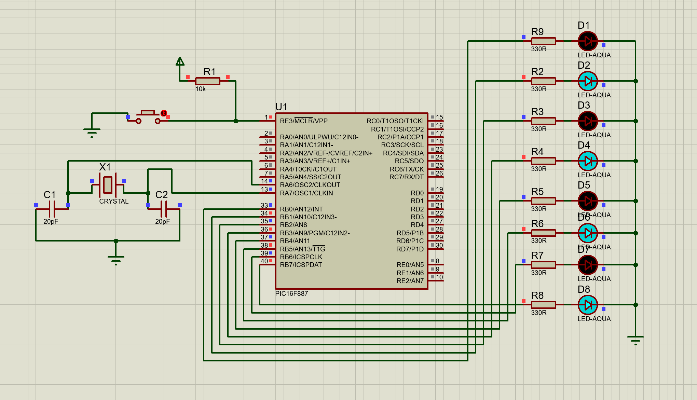

# Blinking_8_LEDs

## Description

This project controls 8 LEDs connected to a PIC16F887 microcontroller. The LEDs blink together for 500ms, followed by alternating blinking of 4 LEDs every 200ms.

## Circuit

**1. All LEDs Off:**

**2. All LEDs On:**

**3. 4 LEDs On, 4 LEDs Off:**

**4. 4 LEDs Off, 4 LEDs On:**

*The circuit schematic for 8 LEDs.*

## Files

- `8_LED.pdsprj`: Circuit schematic for 8 LEDs in Proteus.
- `eight_LED.c`: MikroC program for controlling the LEDs.

## Instructions

1. Open `8_LED.pdsprj` on Proteus.
2. Compile `code.c` in MikroC to generate the hex file.
3. Upload the hex file to Proteus and run the simulation.
4. Observe the LEDs blinking as described:
    - All LEDs will blink together for 500ms.
    - Then, 4 LEDs will blink, while the other 4 remain off for 200ms.
    - Finally, the remaining 4 LEDs will blink for 200ms. 
    

## Tools

- MikroC Pro for PIC
- Proteus ISIS 

